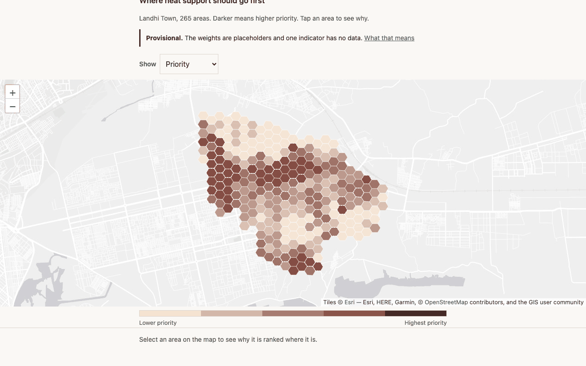
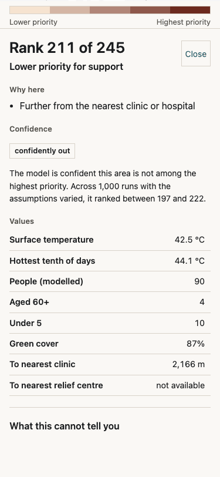
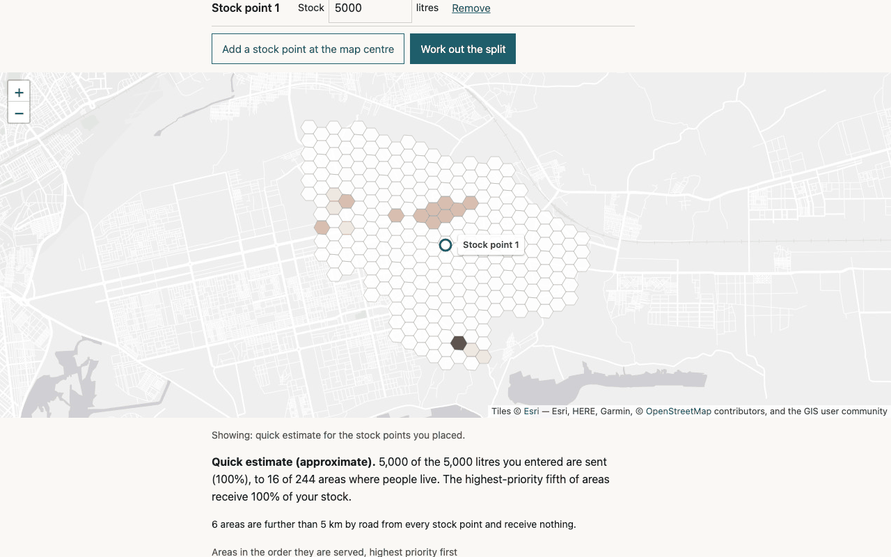

# Karachi Heat Priority Map

A free, mobile-first map to help a Karachi relief team decide where heat-relief
support — drinking water, oral rehydration salts, cooling points, ambulance standby —
should go first during a heatwave, and why. Pilot area: **Landhi Town** (25.37 km²).

**Live site:** <https://samrajukrani0-tech.github.io/karachi-heat-map/>

> **Status: working, provisional.** The site, model, allocation planner, offline mode
> and field briefs are built and tested. Two things are still Samraj's to supply, and
> the site says so wherever they matter: the Vulnerability **weights** are placeholder
> equal weights until he runs the AHP tool (P2-02b), and **no relief centre has been
> verified in person yet** (P1-09b), so distance to a relief centre has no data and the
> planner has no exact scenarios. Expert validation (Phase 6) waits on rankings from
> relief workers in Landhi.



## What it is

Landhi is divided into 265 hexagons of about 0.105 km² (H3 resolution 9). For each one
the model asks three questions:

- **Hazard:** how hot does the ground get on hot-season afternoons? (Landsat surface
  temperature, April–June 2022–2026)
- **Exposure:** how many people live there? (Meta population density)
- **Vulnerability:** how little greenery is there, and how far is it from a clinic or
  a relief centre?

**Priority** is the geometric mean of the three, so all three must be present for an
area to rank highly: a scorching empty factory yard scores zero. Every area shows the
reasons behind its own score in plain words. Its **confidence** comes from 1,000 runs
with the weights and normalisation method varied.



The **Plan supplies** page splits a stock of water or ORS across the areas: highest
priority first, within a road distance your team can reach. Exact plans come from an
integer programme (HiGHS) and are precomputed from verified centres. A quick
estimate runs on the phone and is clearly labelled approximate. The page shows shares
of the stock, never absolute supply totals, because the population layer undercounts
Landhi by about 2.3× (D16, D21).



It also works **offline** after one visit, drawing the main roads in place of the map
background. **Field briefs** are one-page A4 summaries per locality, to print or send
on WhatsApp.

## What it is not

- **Not an official warning system.** Follow the Pakistan Meteorological Department and
  PDMA Sindh for warnings.
- **Not a mortality model.** It never estimates deaths or assigns causes.
- **Not a verdict on any neighbourhood.** It says where support would help most, and
  it says "higher priority for support", never "dangerous" or "unsafe".

The most important limits are stated wherever the numbers appear:

- The population layer counts about half the people the 2023 census found.
- Surface temperature is the temperature of the ground, not the air.
- Age could not be mapped within Landhi, because Meta's age shares are uniform here (D17).
- **Power cuts, the mechanism the Edhi Foundation named in June 2024, are the one
  thing this model cannot see** (D20).

## Reproduce

Requires [uv](https://docs.astral.sh/uv/) (Python 3.12 is installed by uv) and, for the
site checks, Node 20+.

```sh
uv sync
npm ci && npx playwright install chromium    # site checks only

uv run python -m pipeline.run --list         # the 18 steps, in order
uv run python -m pipeline.run --all          # rebuild everything
uv run python scripts/check.py --quick       # quality gates, ends in one CHECK: line
uv run python scripts/check.py --lighthouse  # adds Lighthouse
uv run python scripts/features.py            # progress against the backlog
uv run python scripts/field_briefs.py        # the A4 field briefs (PDF + PNG)
uv run pytest -m "not raw"                   # what CI runs
```

The first `pipeline.run --all` on a fresh clone downloads each source once into
`data/raw/`. Rasters are read in windows, never whole scenes, and Overpass is queried
gently. Every byte is recorded with its URL, sha256, date and licence in
`data/raw/manifest.json`. After that the rebuild uses the cache and touches no network.
A rebuild from the cache reproduces every committed output byte for byte.

To serve the site locally: `python3 -m http.server 8765 --directory site`.

To set the weights (Samraj only, D7b): `uv run python -m pipeline.ahp`, or
`--dry-run` to practise.

`h3` is pinned below 4.4 because 4.4+ ships no x86_64 macOS wheel.

## Reading the repo

| File | What it holds |
|---|---|
| `DECISIONS.md` | every judgement call: options, reasoning, the decision and who made it |
| `QUESTIONS.md` | open questions only Samraj can answer |
| `PROGRESS.md` | append-only log of what was built and the evidence for it |
| `LEARNING_LOG.md` | the modelling ideas in plain language, with practice questions |
| `features.json` | the backlog and the source of truth for progress |
| `docs/model-report.md` | the model, its limitations first, and its results |
| `docs/allocation.md` | the allocation LP, with two examples solvable by hand |
| `docs/data-dictionary.md` | every column, its unit, source and known bias |
| `data/SOURCES.md` | every dataset: URL, licence, access date, resolution, caveats |
| `config/` | the decisions as machine-readable settings |
| `pipeline/` | fetch, grid, indicators, model, AHP, sensitivity, validation, allocation |
| `site/` | static HTML, CSS and vanilla JavaScript, no build step |
| `tests/` | pytest, plus Playwright end-to-end tests in `tests/e2e/` |

## Credits

| Used for | Source | Licence |
|---|---|---|
| Boundary, roads, health facilities | © OpenStreetMap contributors, via Overpass | ODbL 1.0 |
| Surface temperature | USGS Landsat 8/9 Collection 2 Level-2, via Microsoft Planetary Computer | US public domain |
| Population and age counts | Meta High Resolution Population Density (Data for Good), via HDX | CC BY 4.0 |
| Population cross-check | WorldPop constrained 100 m, Pakistan 2020 | CC BY 4.0 |
| Green cover and built-up surface | ESA WorldCover 10 m 2021 v200 | CC BY 4.0 |
| Census comparison | Pakistan Bureau of Statistics, 2023 census | official statistics |
| Survival water figure | The Sphere Handbook 2018, p. 107 and Appendix 3 | cited, not redistributed |
| Basemap | Esri World Light Gray Canvas: Esri, HERE, Garmin, © OpenStreetMap contributors | free, no key |
| Map library | Leaflet 1.9.4, vendored | BSD-2-Clause |

Full details, access dates and caveats are in [`data/SOURCES.md`](data/SOURCES.md).

## Licences

- **Code:** MIT ([`LICENSE`](LICENSE)).
- **Documentation and site text:** CC BY 4.0 ([`LICENSE-docs`](LICENSE-docs)).
- **`data/processed/` and `site/data/`:** ODbL 1.0 ([`LICENSE-data`](LICENSE-data)). They
  contain values derived from OpenStreetMap, © OpenStreetMap contributors, so the
  share-alike terms apply.
- Every source dataset keeps its own licence, listed above.

To cite this project, see [`CITATION.cff`](CITATION.cff).

## AI assistance

Built with Claude Code as a coding assistant. Research question, modelling decisions,
weights and fieldwork by Samraj Lal Ukrani.
